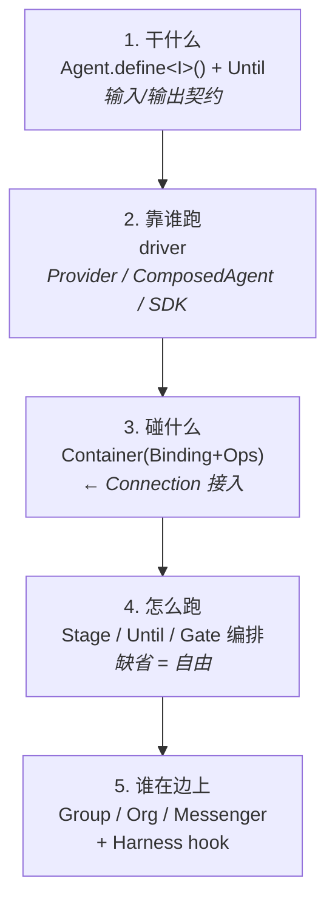
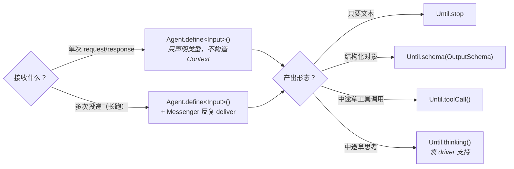
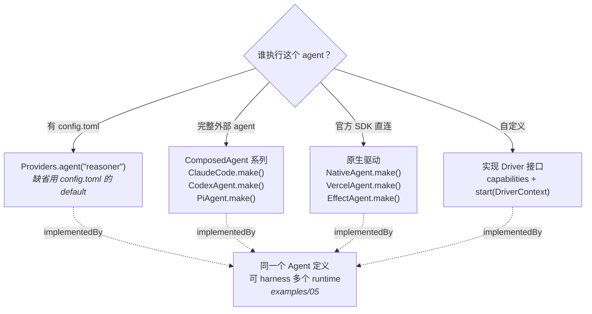
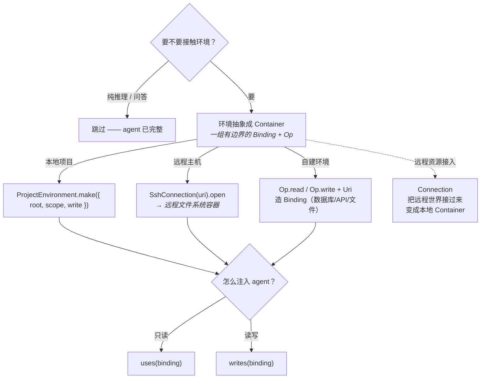
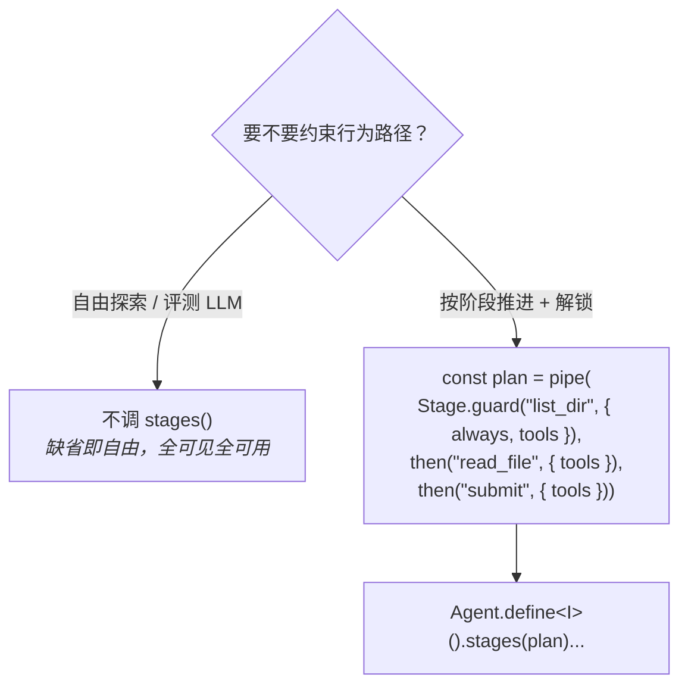
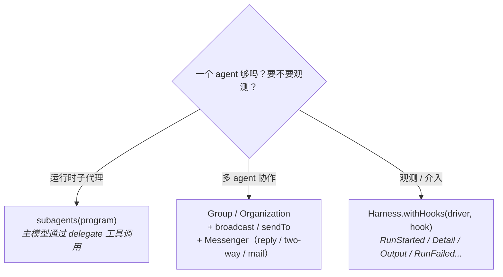
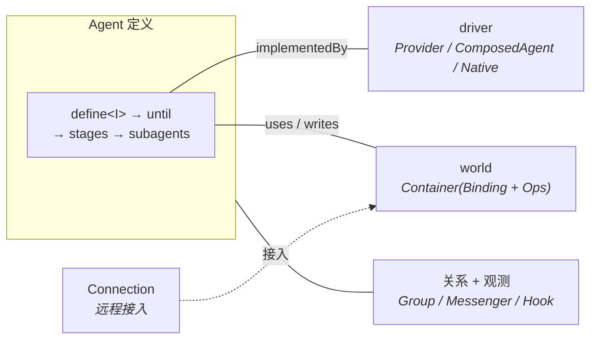

# GUIDELINES —— 如何设计一个 Agent

> 定义 agent 不是写代码，是回答五个问题：**干什么 / 靠谁跑 / 碰什么 / 怎么跑 / 谁在边上**。
> 每个问题对应一组抽象。按下面的逻辑图走，缺省即自由，显式即约束。
>
> 本文档每个符号都是真实 API，与代码一一对应。

## 一、总览：五个决策点

**核心原则**：
- 纯 agent = 只回答 1、2。
- 越靠近真实世界 = 回答得越多。
- 每个决策点都有缺省值，不回答 = 用缺省（自由跑）。

---

## 二、决策逻辑图（详细版）

### 2.1 干什么 —— 输入 / 输出

> 输入完全通过 **Delivery** 传输，`define<I>()` 不接收 Context 构造。
> 业务输入在 `run(input)` 时经 `toMessage` 归一化注入 `messages`。

### 2.2 靠谁跑 —— 选 driver

> driver 是唯一的执行者。agent 定义不绑定 driver，`implementedBy(driver)` 才绑定。
> ComposedAgent 也可以把一个已完成的 Harness Agent「命名」成可复用组合程序，
> 再用 AgentKeeper 保持存活（examples/16）。

### 2.3 碰什么 —— 世界抽象成 Container

> **关键心智**：环境永远是 Container。本地目录、SSH 远程、远程 API 是同一个抽象
> （Resource 语义与物理位置分离）。`Connection` 只是「把远程世界接过来变成本地 Container」。

### 2.4 怎么跑 —— 编排（缺省 = 自由）

> Stage = 推进路径，Gate = 每阶段的解锁（改 always / 挂容器 / 控工具）。

### 2.5 谁在边上 —— 关系 + 观测

---

## 三、快速决策表

| 你的需求 | 用的抽象 | 代码 |
|---|---|---|
| 纯问答 | `define` + `Until.stop` | `Agent.define<string>().returns(Until.stop).implementedBy(driver)` |
| 结构化输出 | `Until.schema` | `.returns(Until.schema(Output))` |
| 走 config.toml | `Providers` | `yield* Providers.agent()` |
| 用 Claude Code | `ClaudeCode.make()` | `.implementedBy(ClaudeCode.make())` |
| 读本地项目 | `ProjectEnvironment` | `.uses(ProjectEnvironment.make({ root }))` |
| 写远程 SSH | `SshConnection` | `.writes((yield* SshConnection(uri).open).bindings[0])` |
| 按阶段推进 | `Stage`/`then` | `.stages(pipe(Stage.guard(...), then(...)))` |
| 运行时子代理 | `SubagentProgram` | `.subagents({ id, until, access, context })` |
| 多 agent 扇出 | `Group` + `broadcast` | `broadcast(makeGroup("t", agents), delivery)` |
| 观测运行 | `Harness.withHooks` | `Harness.withHooks(driver, DetailHook)` |

---

## 四、心智模型

**一句话记忆**：
- `Agent.define` 是「我」，`driver` 是「手脚」，`Container` 是「环境」，`Stage` 是「计划」，`Group/Messenger` 是「团队」，`Harness.hook` 是「镜子」。

---

## 五、示例索引

| 想看的场景 | 示例 |
|---|---|
| 最小文本 agent | `examples/01-text.ts` |
| 结构化输出 | `examples/02-object.ts` |
| 注入工具 | `examples/03-tool.ts` |
| 同一个定义 harness 多 runtime | `examples/05-composed-agents.ts` |
| Claude Code + 项目工具 | `examples/07-review-project.ts` |
| 运行时子代理 | `examples/08-subagents.ts` |
| 远程 SSH 世界 | `examples/09-ssh-game.ts` |
| 多 agent 黑板协作 | `examples/10-blackboard-puzzle.ts` |
| 多角色 swarm + 监督 | `examples/13-agent-swarm.ts` |
| 编排（Stage/Gate） | `examples/19-orchestration.ts` |
| 自由 vs 编排对比 | `examples/21-free-vs-orchestrated.ts` |
| 顾问架构（agent 作工具） | `examples/22-advisor.ts` |
| 观测 hook | `examples/hooks/detailed-review.ts` |
