# Board and the fleet — architecture and sequences

> Diagrams for `docs/board-white-paper.md` at implementation granularity. Every node and
> message below is a real file, route or call: package paths are relative to the repository
> root, HTTP paths are the ones `http:` in the `operation()` declarations serve, and the
> tool names are board's and agentd's own.
>
> Design: `docs/board.md`. Contract: `docs/board-tools.md`. Product: `docs/board-white-paper.md`.

## 1. Deployment

Who talks to whom, and over what. Two rules shape every edge: **a machine only ever calls
out**, and **an agent has exactly one door**.

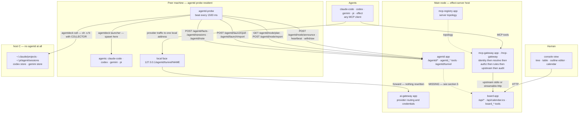

The dashed edge is the one gap: an intent agentd queued and a machine ran does not, by
itself, become a run on a board node. Section 5 draws what is missing.

## 2. Module map

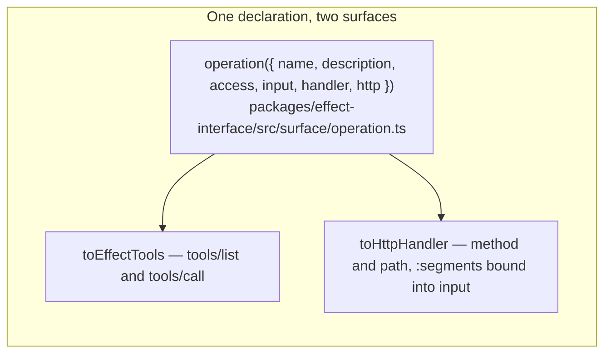

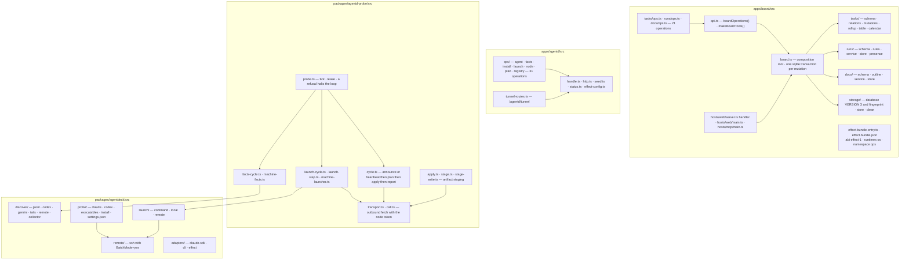

`apps/agentd` depends on `packages/agentd-probe` for the node vocabulary;
`packages/agentd-probe` reaches `packages/agentdeck` only at the edge
(`machine-launcher.ts`), which is why `launch-cycle.ts` can declare what it needs from a
runner structurally and stay free of any CLI dialect.

## 3. The beat

One pass of `probe.ts`'s `tick()`. The order matters: a machine that cannot report a
deployment has no business claiming work, so the deployment cycle runs first.

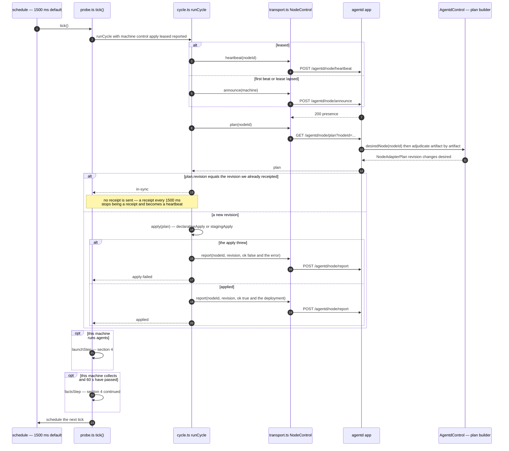

A `refused` fault halts the loop and says so — the identical call is refused identically
forever, so repeating it is a spin rather than a retry. Every other fault, an unreachable
control plane included, is worth another beat: a node that keeps trying and ages offline is
telling the truth, while one that gives up is reporting a health it cannot know. On `stop()`
the goodbye is delivered before the loop ends, because an undelivered `withdraw` would leave
a node listed as up until its lease happened to lapse.

## 4. What the machine reports

### 4.1 Sessions and facts — local, and over ssh

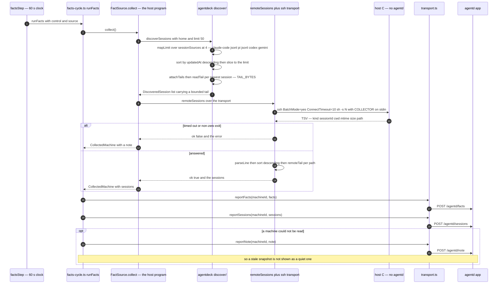

A remote result is a typed outcome where local discovery quietly returns fewer sessions:
"This machine has no sessions" and "this machine did not answer" are different facts, and a
control plane that conflates them reports an unreachable host as idle.

### 4.2 Launch — the queue is pulled, never pushed

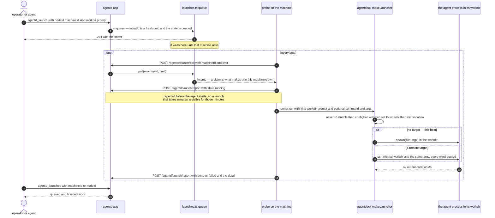

A kind with no preset and no explicit command is refused rather than run: the dialect table
falls back to `custom` for anything it does not know, which is right for a caller who asked
for custom and a silent wrong answer for one who asked for an agent this machine has never
heard of. `agentd_install` is this same path — the argv comes from the machine's own reported
`installs`, so the center never looks up a package name.

## 5. The agent against the graph

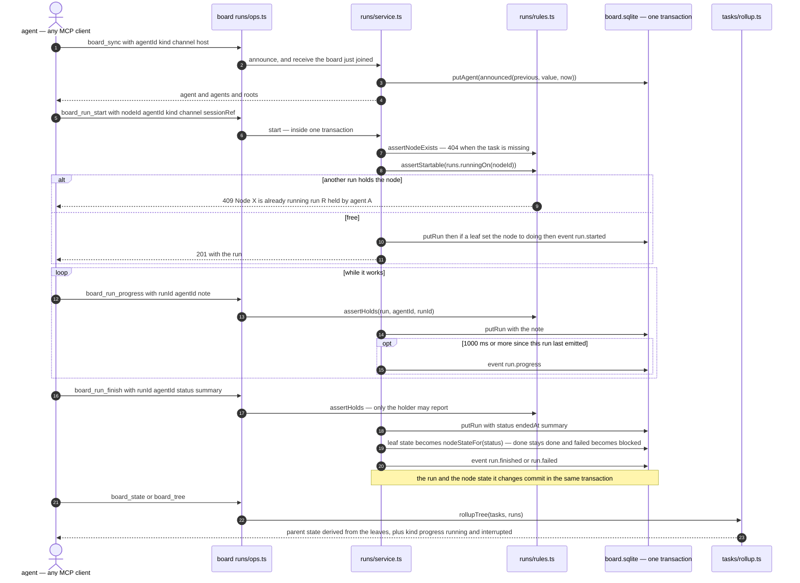

Three rules are visible in that diagram and nowhere else: a node has at most one running
run, only the holder may report, and board schedules nothing — the agent starts the run and
board records the claim. `channel` says how it arrived — `mcp-self` for this path, `probe`
for a run a machine reported on the agent's behalf, `runtime` for the in-process runtime.

**The dashed edge from section 1, drawn.** What is missing is not a rule inside board; it is
a caller. A launched agent reports to agentd (section 4.2) and to board only if it happens to
hold board's tools and chooses to use them:

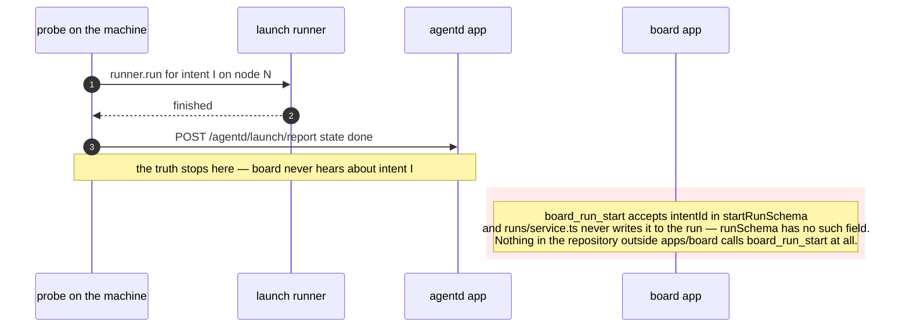

Closing it is one seam: when a machine settles a launch intent that names a board node, board
should carry the run with `channel: "probe"` and `intentId` filled — so a launched agent and
a self-announced one land in the same record, which is what the two fields were added for.

## 6. Through the door

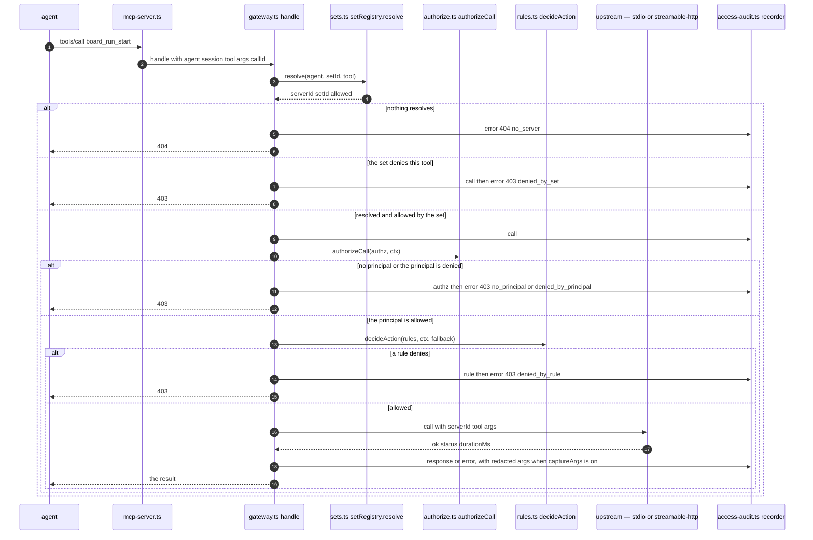

Identity is trusted only from standard transport headers (`x-agent-id`, `x-session-id`,
`x-request-id`) or a validated auth, and every path through this pipeline emits an audit
event. Real upstream endpoints and stdio commands never appear in agent configuration.

## 7. The tunnel

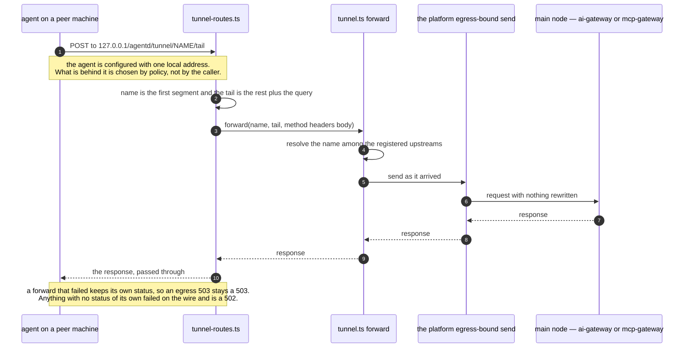

`GET /agentd/tunnel` lists the upstreams with their local paths; any other method there is a
405. The tunnel is not a second proxy with its own rules — it resolves a name and hands the
request to the platform's governed send, which is what keeps policy, credentials and audit in
one place.

## 8. Board's own start

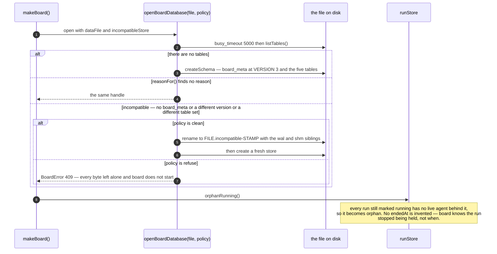

`orphan` is board's own finding and can never be an agent's claim, and the most recent run
decides whether a node is still reported as `interrupted`.

## 9. What these diagrams deliberately leave out

- **The kernel and artifact lifecycle.** `effect.bundle.json`, staging, activation, rollback,
  the ABI gate and kernel hot-swap are on the path between the host and every app, and only
  board ships a bundle. Drawn separately in `docs/architecture-rework.md` §7–8.
- **The console's own rendering.** `effect-ui.ts` and the public scripts in
  `apps/board/src/hosts/web/public/` are a client of the same `/api/*` routes the MCP tools
  are served on — which is the point of section 6, and why no second API exists to draw.
- **The unverified path.** The ssh collection in 4.1 is exercised against the collector
  script and a fake transport; this development machine has no sshd, so the live-remote
  success path has not been observed.
