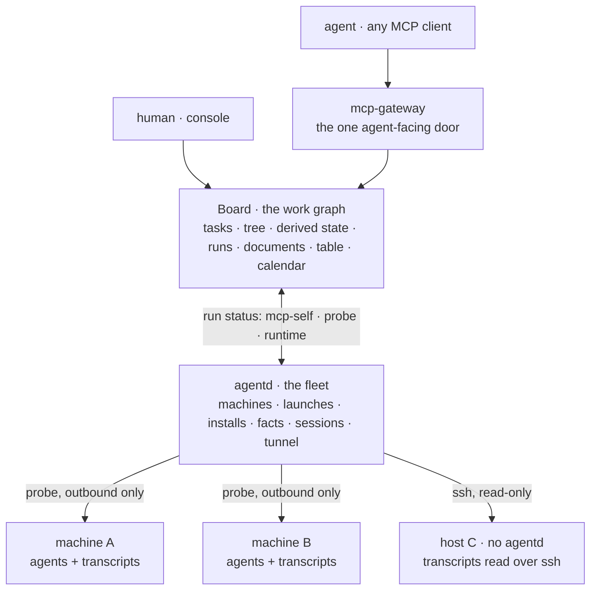

# Board — white paper

> A shared work graph for humans and agents, over a fleet of machines.
>
> Audience: the people deciding whether to run their agent work on this. Engineering
> detail lives in `docs/board.md` (design), `docs/board-tools.md` (the exact tool and
> route contract) and `docs/board-architecture.md` (diagrams: architecture and every
> sequence); this document is the product.

## 1. Summary

Board is where work is described once and worked by many. A task is a node in a tree; a run
is a record of one agent holding one node; a machine is a place agents and their transcripts
live. A person plans and inspects the graph, an agent claims and reports against it, and a
fleet layer (`agentd`) collects what the machines have and hands them work to do — all
through one MCP surface, so the human view and the agent view cannot disagree.

The one-sentence version: **an agent may declare what it is doing; Board decides whether
that declaration is consistent with what it has already recorded.**

## 2. The problem

Agents are already doing real work. The work is invisible.

- **It lands where nothing else can read it.** A transcript on one machine's disk, a
  provider credential in one home directory, a plan in one person's head. Run five agents on
  three machines and you have five histories and no answer to "what is being worked on right
  now, by whom, on which machine, and what did the agent before it already try?"
- **The two halves are always split.** A task tracker knows the work but not the machines; a
  session manager knows the machines but not the work. Neither can hand a specific task to a
  specific machine in a specific directory — and neither can be read by an agent, only typed
  into by a human.
- **Agents that hand off to each other start from nothing.** The second agent on a task does
  not know what the first one did, so it re-does it, or worse, undoes it.

The cost is not any single failure. It is that agent work does not accumulate: every session
is a fresh start, and the person supervising can only watch one terminal at a time.

## 3. The idea

Three commitments, and everything else follows.

**One work graph.** All work is described in Board — structure, dependencies, state,
history. Humans and agents read the same tree, and neither can be talked into a second
version of the truth. Board is a platform invariant, not a convenience: if each agent
invented its own task semantics, no fleet-level question would have an answer.

**Machines push; the center never reaches in.** A machine runs a probe that announces
itself, reports what it has, and asks for work. The center never opens a connection to a
machine, so a machine behind NAT or a firewall is a first-class member, and an unreachable
machine is simply one that stopped pushing — a fact, not an error to work around.

**One door.** Every capability is declared once and served twice: as an MCP tool and as an
HTTP route, from the same declaration, validated by the same schema, executed by the same
handler. A human clicking in the console and an agent calling a tool are doing the same
thing to the same records. There is no agent-only back door and no human-only control panel.

## 4. What it does

### See the work

Board reads the session history of the agents already on your machines — **claude-code,
codex, gemini, pi** — from each agent's own store, on this machine or over ssh on a host
that runs nothing at all. Discovery is a registry: adding an agent means adding one reader,
not teaching every caller where sessions live.

Sessions carry their working directory and their recency, and the newest few ship a bounded
tail of their transcript to the center. **The full transcript never leaves the disk it was
written to** — the center holds a window, not a copy, which is what makes "let the next
agent see what the last one did" safe to offer.

### Place the work

Tasks are nodes in a tree, with dependencies and a state. A parent's state is **derived**
from the leaves below it, so "parent done, child still running" cannot exist; what an
operator set and what the children make it are reported separately rather than quietly
reconciled.

Work is claimed, not assigned by a scheduler. An agent takes a node and holds it for the
duration — **a node has at most one holder**, the second claim is refused and told who holds
it, and only the holder may report progress or the outcome. Runs record how an agent arrived
(`mcp-self` claimed over MCP, `probe` reported by a machine on the agent's behalf,
`runtime` in-process), which agent it was, and which session it is. After a restart, a run
nobody reported on is marked `orphan` — Board's own finding, never an agent's claim.

### Run the work

Board does not launch anything; that belongs to the fleet layer. `agentd` takes a launch
request — a node, a machine, an agent kind, a working directory, a prompt — queues it, and
the machine's probe pulls it and runs it. The same path runs local work and work on a host
reached over ssh.

The same queue carries **installs**, because installing an agent on someone's machine is a
mutation and should land with a receipt like any other work. The center never looks up a
package name: the machine reports the argv it would run for each agent it knows about, and
the center runs what the machine named. Detection is read-only — installed, version,
provider, credentials, MCP servers — and it never writes an agent's config.

Machines reach the platform's shared services through a **tunnel**: agents are configured to
talk to one local address, and where that traffic actually goes is decided by egress policy.
On a peer it leaves through the main node's gateway, which is the one holding provider
credentials and MCP servers; on the main node the same address is answered locally. A tunnel
resolves a name and hands the request to the platform's governed send — it is not a second
proxy with its own rules, so policy, credentials and audit stay in one place.

### Shape the work

- **Table** — the same tasks as rows, including the column that earns a table its place:
  *who holds this node right now*. It is a projection, not a second store.
- **Documents** — outline documents for work that is a structure rather than a list. Edited
  one operation at a time against the version it was read at, so two collaborators touching
  different parts of one outline do not overwrite each other.
- **Calendar** — an RFC 5545 feed of the tasks with a due time, subscribing into Apple
  Calendar like any other. An agent that plans its own schedule writes into the same tasks a
  person reads.
- **Events** — ordered, replayable history. High-frequency progress is coalesced, and every
  change commits together with the event that describes it.

## 5. Design principles

| Principle | What it buys |
|---|---|
| **Declare once, serve twice** | A capability is one entry, not a tool plus a route plus the wiring between them. The two surfaces cannot drift. |
| **Record, do not schedule** | Board decides whether a claim is consistent; it never wakes a machine or holds an intent queue. Scheduling is a different app's problem, and can change without touching task data. |
| **Derive, never duplicate** | Parent state, node kind, agent presence and table cells are computed. Where a second copy could disagree with the first, there is no second copy. |
| **The machine reports** | Outbound-only from every worker. No inbound connection, no credential the center must hold for a machine. |
| **The transcript stays home** | The center holds a bounded tail. Reading someone's work does not mean copying it. |
| **Never migrate** | A store this build cannot read is moved aside, byte for byte, and a fresh one is created — or the app refuses to start and leaves it alone. Nothing is rewritten on the operator's behalf. |
| **A refusal names the holder** | "Already running: run X held by agent Y" is actionable. "Conflict" is not. |

## 6. How it fits together

Board and the fleet layer are separate apps with separate stores, joined by one rule: the
fleet runs work, the graph records it. The file-level view of the same picture, and the
sequence diagrams for every path through it, are in `docs/board-architecture.md`.

## 7. Deployment shapes

**One machine.** Board, the fleet layer, and the agents all local. The probe runs against
`127.0.0.1`. This is the smallest useful deployment and the one to start with.

**A main node with peers.** One machine holds the provider credentials and the MCP servers.
Peer machines tunnel their agent traffic to it, so every agent on every machine is configured
with a local address that does not change when a machine's role does.

**Hosts with no agentd.** A machine that runs nothing still contributes its session history,
read over ssh, read-only. Useful for machines you are evaluating before installing anything
on them — and for the machines you would rather not install anything on at all.

## 8. What is real today

Shipped and working: session discovery for claude-code / codex / gemini / pi, local and over
ssh, with the tail window; the task tree with derived state and dependency rules; the run
lifecycle with one holder per node and the three arrival channels; the launch queue with
working directories, local and over ssh; install plans executed as work with a receipt;
read-only machine facts including provider and MCP configuration; the tunnel; the table,
documents, calendar and events; and the single-declaration MCP + HTTP framework that all 21
Board operations and all 31 fleet operations are written in.

Open, stated plainly:

1. **The launch-to-run seam.** A run started on a machine by the fleet layer does not yet
   create a run record in Board: `board_run_start` accepts an `intentId`, and nothing writes
   it to the run — and nothing outside Board calls `board_run_start` at all. So a launched
   agent reports to the fleet and reaches the graph only if it happens to hold Board's tools
   and chooses to use them. **This is the one real gap in the loop**, and closing it is next.
2. **The ssh success path is unverified on a real host** — this development machine has no
   sshd, so remote collection has been exercised against the scripts and a fake transport,
   not a live remote.
3. **Runtime portability is declared, not earned.** Board ships as a portable artifact, but
   its storage is still opened through the host's own APIs; running the same artifact on a
   browser or sandbox target needs the store injected as a capability first.

## 9. Why this is different

- **Not a task tracker with an agent bolted on.** The run — who holds what, since when, in
  which session — is a first-class record, and the agent that holds a task is the one that
  must report on it. A tracker that lets anyone mark anything done cannot answer "who is
  doing this right now".
- **Not a session manager.** Sessions are how you *see* the work; the graph is how you
  *place* it. Knowing that an agent is running is not knowing which task it is running.
- **Not an orchestrator.** There is no scheduler, no priority queue, no resource governor.
  Work is claimed rather than dispatched, which is what lets the same graph serve agents that
  were launched by the fleet and agents that simply connected.
- **Readable by both audiences.** Every capability exists as a tool before it exists as a
  button, and both go through the same validation. An agent is not a second-class user of
  the product, and a human is not locked out of what the agent can do.

## 10. Where it goes next

1. **Close the launch-to-run seam** so a machine-launched agent's run appears on its node
   without the agent having to arrange it.
2. **Verify the ssh path on a live host**, and keep a machine-readable record of what was
   actually observed rather than what was expected.
3. **Earn the portability claim** by injecting the store, which also moves Board off the
   ambient-dependency list.
4. **Reevaluate dependencies when work finishes** — today a waiting task becomes claimable
   only when someone looks.
